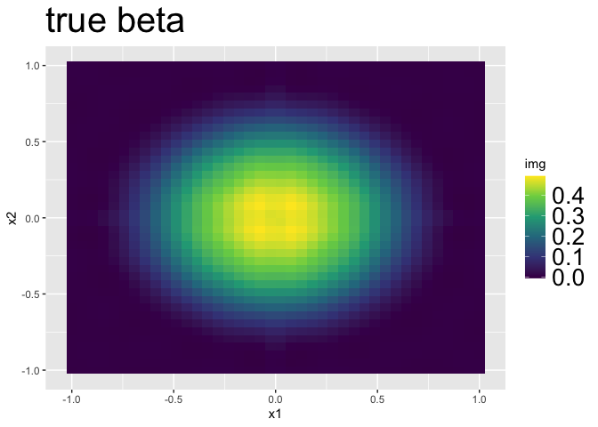

SBIOS:Vignette
================
Yuliang Xu
2023-09-13

# installation

``` r
devtools::install_github("yuliangxu/SBIOS")
#> Skipping install of 'SBIOS' from a github remote, the SHA1 (98edc289) has not changed since last install.
#>   Use `force = TRUE` to force installation
```

# Examples

## A simulated 2d example

### create a testing case

*sbios_path* is a user-defined default path in this example.

``` r
library(BayesGPfit)
#> Loading required package: lattice
library(ggplot2)
library(viridis)
#> Loading required package: viridisLite
library(SBIOS)

# a folder to put the splitted data set
outpath = file.path(sbios_path,"data") 

# set true parameters for simulation

missing_percent = 0.5 
common_percent = 0.9
sigma_Y = 1


n = 1000; subsample_size = 200
side = 40
n_batch = n/500;

# the generated data is saved in a name like this datsim_n2000data_multiGP_batch_n2000_p3600_L360_b1.rds
sim_name = paste("datsim_n",n,sep="") 

contiguous_common = T


# create a testing case ---------------------------------------------------

# create true image pattern
num_region = 4

p = side*side
region_idx = vector("list",num_region)
grids = GP.generate.grids(d=2L,num_grids=side)


idx_matr = matrix(1:(side*side),ncol = side)
side_per_region = side/sqrt(num_region)
for(r in 1:num_region){
  idx = rep(NA,(side_per_region)^2)
  colr = r - floor(r/sqrt(num_region))*sqrt(num_region);if(colr==0){
    colr = sqrt(num_region)
  }
  rowr = ceiling(r/sqrt(num_region));
  col_range = (max(colr-1,0):colr)*side_per_region;col_range[1] = col_range[1]+1;
  row_range = (max(rowr-1,0):rowr)*side_per_region;row_range[1] = row_range[1]+1;
  region_idx[[r]] = c(idx_matr[row_range[1]:row_range[2],col_range[1]:col_range[2]])
}


grids_df = as.data.frame(grids)


center = apply(grids,2,mean)
rad = apply(grids,1,function(x){sum((x-center)^2)})
inv_rad = 2-rad
inv_rad_ST = Soft_threshold(inv_rad,1.2)

beta = log(inv_rad_ST^2+1)

# create a suitable basis
l = round(p/num_region*0.1)
GP = generate_matern_basis2(grids, region_idx, rep(l,length(region_idx)),scale = 2,nu = 1/5,
                            show_progress=T)
#> [1] "Computing basis for block  1"
#> [1] "Computing basis for block  2"
#> [1] "Computing basis for block  3"
#> [1] "Computing basis for block  4"


L = sum(GP$L_all)

basis = GP; 
basis$D_vec = unlist(basis$Phi_D)
L = length(unlist(GP$Phi_D))


# generate gamma from basis
q = 4
theta_gamma = matrix(rnorm(L*q), nrow = L)
gamma = Low_to_high(theta_gamma,GP)

# generate a testing case
data_params = generate_large_block_multiGP_data_FBM(n,beta,gamma,GP,region_idx,outpath,sim_name,
                                                    sigma_Y=sigma_Y,
                                                    q = q,n_batch = n_batch)
#> [1] "generating eta for region  1"
#> [1] "generating eta for region  2"
#> [1] "generating eta for region  3"
#> [1] "generating eta for region  4"
#> [1] "Creating Y"
#> [1] "Spliting data into batches"
true_coef = cbind(data_params$beta*data_params$delta,data_params$gamma)

# save locations of all batches of data in a list object
data_nm = file.path(outpath,paste(sim_name,"data_multiGP_batch_n",n,"_p",p,"_L",L,sep=""))

data_path_list = NULL
for(b in 1:n_batch){
  data_path_list = c(data_path_list,paste(data_nm,"_b",b,".rds",sep=""))
}


# create a set of initial values

init_params0 = list(theta_beta = rep(1,L),
                    theta_gamma = matrix(rep(1,q*L), nrow = L),
                    theta_eta = matrix(0,nrow=L,ncol=n),
                    eta = matrix(0,nrow=p,ncol=n),
                    delta = rep(1,p),
                    sigma_Y = 1, sigma_beta = 1, sigma_eta = 1, sigma_gamma=1)
beta_GP = beta
lambda = 0.5
beta_GP[beta>0] = beta[beta>0] + lambda
beta_GP[beta<0] = beta[beta<0] - lambda
theta_beta_init = High_to_low(as.matrix(beta_GP),basis)
delta = rep(1,p)
delta[beta==0]=0

# record true parameters
init_params_true = list(theta_beta = theta_beta_init,
                        theta_gamma = theta_gamma,
                        theta_eta = data_params$theta_eta,
                        eta = Low_to_high(data_params$theta_eta,basis),
                        delta = delta,
                        sigma_Y = data_params$sigma_Y, 
                        sigma_beta = 1, sigma_eta = 1, sigma_gamma=1)

# visualize the true image
plot_img(data_params$beta, grids_df, title = "true beta")
```

<!-- --> \###
read in list of data

``` r
total_batch = length(data_path_list)
batch_size_list = diff(ceiling(seq(1,n+1,length.out = length(data_path_list)+1)))

# create individual masks
print(paste("common_percent = ",common_percent))
#> [1] "common_percent =  0.9"
print(paste("missing_percent = ",missing_percent))
#> [1] "missing_percent =  0.5"
print(paste("contiguous_common = ",contiguous_common))
#> [1] "contiguous_common =  TRUE"
mask_list_all = get_random_mask(total_batch, batch_size_list,p,n,
                                common_percent, missing_percent,
                                contiguous_common,grids)

# read data as a FBM
data_list = NULL

data_list = read_data_list_to_FBM_impute(data_path_list,mask_list_all$mask_list_fbm,basis)
#> [1] "reading data batch  1"
#> [1] "reading data batch  2"

data_list$mask_list = mask_list_all$mask_list

# get individual imputation list for method_imp_idx first
total_imp = unlist(lapply(mask_list_all$mask_list_fbm, function(x){sum(bigmemory::as.matrix(x)==0)}))

imp_idx_list = get_imp_list(mask_list_all$mask_list_fbm,region_idx)


# create indices for voxel locations and basis 
dimensions = list(n=n,L=L, p=p, q=q)
region_idx_cpp = lapply(region_idx,function(x){x-1})
L_idx = vector("list",num_region)
L_start = 1
for(r in 1:num_region){
  L_end = L_start + basis$L_all[1] - 1
  L_idx[[r]] = L_start:L_end
  L_start = L_end + 1
}
L_idx_cpp = lapply(L_idx,function(x){x-1})
batch_idx = vector("list",length(data_list$Y_list))
b_start = 1
for(b in 1:length(data_list$Y_list)){
  b_end = b_start + dim(bigmemory::as.matrix(mask_list_all$mask_list_fbm[[b]]) )[2] - 1
  batch_idx[[b]] = b_start:b_end
  b_start = b_end + 1
}
batch_idx_cpp = lapply(batch_idx,function(x){x-1})
```

### Run Gibbs sampler with no memory mapping feature

``` r
## remember to change subsample size accordingly
controls = list(lambda = 0.5, prior_p = 0.5, n_mcmc = 5000,
                start_delta = 0 , subsample_size = subsample_size, step = 1e-3,
                burnin = 0, thinning = 10, interval_eta = 100,start_saving_imp = 1000,
                seed = sample(1:1e5,1))

# GS with zero imp --------------------------------------------------------

data_list_gs = read_data_list_to_gs(data_path_list,mask_list_all$mask_list_fbm)
#> [1] "to gs: reading data batch  1"
#> [1] "to gs: reading data batch  2"


gs0 = method2_gs_no_mem(data_list_gs, basis,
                        dimensions,
                        init_params0, region_idx_cpp, L_idx_cpp,
                        batch_idx_cpp, lambda = controls$lambda, prior_p = controls$prior_p,
                        n_mcmc = controls$n_mcmc,  start_delta=controls$start_delta,
                        subsample_size=controls$subsample_size, step = controls$step,
                        burnin = controls$burnin,
                        thinning = controls$thinning,
                        interval_eta = controls$interval_eta,
                        a = 1, b = 1,
                        testing = 0, display_progress = 1)
```

### Run SBIOS0 (SGLD with no imputation)

``` r
controls$step_controls = list(a=0.0001,b=10,gamma = -0.35)
x = 1:5000
step = with(controls$step_controls, a*(b+x)^gamma)
summary(step)
#>      Min.   1st Qu.    Median      Mean   3rd Qu.      Max. 
#> 5.071e-06 5.606e-06 6.458e-06 7.675e-06 8.218e-06 4.320e-05


init_params0 = list(theta_beta = rep(1,L),
                    theta_gamma = matrix(rep(1,q*L), nrow = L),
                    theta_eta = matrix(0,nrow=L,ncol=n),
                    eta = matrix(0,nrow=p,ncol=n),
                    delta = rep(1,p),
                    sigma_Y = 1, sigma_beta = 1, sigma_eta = 1, sigma_gamma=1)
init_theta_eta = init_params0$theta_eta
init_params0$theta_eta = NULL
init_params0$eta = NULL
theta_eta_path = vector("list",n_batch)
for(b in 1:n_batch){
  print(paste("create theta_eta path for batch ",b))
  batch_idx = batch_idx_cpp[[b]]+1
  theta_eta_path[[b]] = bigmemory::as.big.matrix(init_theta_eta[,batch_idx])@address
}
#> [1] "create theta_eta path for batch  1"
#> [1] "create theta_eta path for batch  2"

sgld0 = SBIOS0(data_list, basis, theta_eta_path,
               dimensions,
               init_params0, region_idx_cpp, L_idx_cpp,
               batch_idx_cpp, lambda = controls$lambda, prior_p = controls$prior_p,
               n_mcmc = controls$n_mcmc,  start_delta=controls$start_delta,
               subsample_size=controls$subsample_size, step = controls$step,
               burnin = controls$burnin,
               thinning = controls$thinning,
               interval_eta = controls$interval_eta,
               a_step = controls$step_controls$a,
               b_step = controls$step_controls$b,
               gamma_step = controls$step_controls$gamma,
               update_individual_effect = 1,
               a = 1, b = 1,
               testing = 0, display_progress = 1)

# check convergence
# plot_check(sgld0)

sgld0$controls = controls
```

### Run SBIOS (SGLD with imputation)

``` r
init_params0 = list(theta_beta = rep(1,L),
                    theta_gamma = matrix(rep(1,q*L), nrow = L),
                    theta_eta = matrix(0,nrow=L,ncol=n),
                    eta = matrix(0,nrow=p,ncol=n),
                    delta = rep(1,p),
                    sigma_Y = 1, sigma_beta = 1, sigma_eta = 1, sigma_gamma=1)

sgld = SBIOSimp(data_list, basis,dimensions, imp_idx_list, total_imp,
                init_params0, region_idx_cpp, L_idx_cpp,
                batch_idx_cpp, lambda = controls$lambda, prior_p = controls$prior_p,
                n_mcmc = controls$n_mcmc,
                start_saving_imp = controls$start_saving_imp,
                start_delta=controls$start_delta,
                subsample_size=controls$subsample_size, step = controls$step,
                burnin = controls$burnin,
                seed = controls$seed,
                thinning = controls$thinning,
                interval_eta = controls$interval_eta,
                all_sgld = 1,
                a_step = controls$step_controls$a,
                b_step = controls$step_controls$b,
                gamma_step = controls$step_controls$gamma,
                update_individual_effect = 1,
                a = 1, b = 1,
                testing = 0, display_progress = 1)

sgld$controls = controls
```

### summarize result

``` r
burnin = as.integer(((0.8*controls$n_mcmc):(controls$n_mcmc-1))/controls$thinning)
burnin = burnin[!duplicated(burnin)]
beta_mcmc_SBIOSimp = Low_to_high( sgld$theta_beta_mcmc[,burnin],GP)
beta_mcmc_SBIOS0 = Low_to_high( sgld0$theta_beta_mcmc[,burnin],GP)
beta_mcmc_GS0 = Low_to_high( gs0$theta_beta_mcmc[,burnin],GP)

beta_SBIOSimp = apply(beta_mcmc_SBIOSimp * sgld$delta_mcmc[,burnin],1,mean)
beta_SBIOS0 = apply(beta_mcmc_SBIOS0 * sgld0$delta_mcmc[,burnin],1,mean)
beta_GS0 = apply(beta_mcmc_GS0 * gs0$delta_mcmc[,burnin],1,mean)

list_of_img = list(true_beta = data_params$beta,
                   beta_SBIOSimp = beta_SBIOSimp,
                   beta_SBIOS0 = beta_SBIOS0,
                   beta_GS0 = beta_GS0)
plot_multi_img(list_of_img,grids_df,  n_img_per_row = 2, col_bar = c(0,0.7))
```

<!-- -->

## An example using simulated Nifti data

### create a testing case

``` r
library(RNifti)
```
